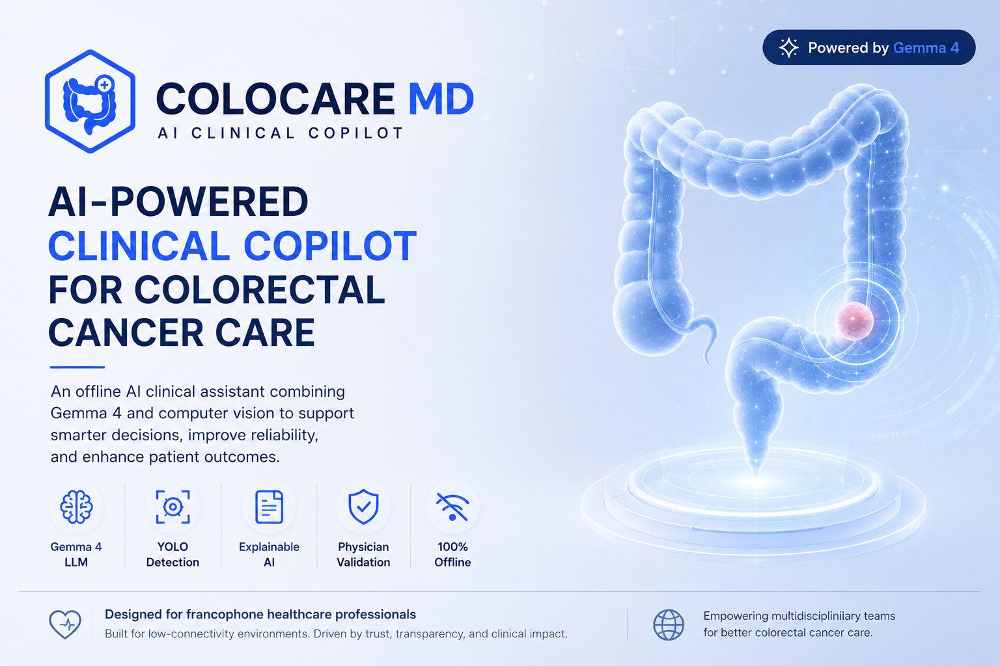
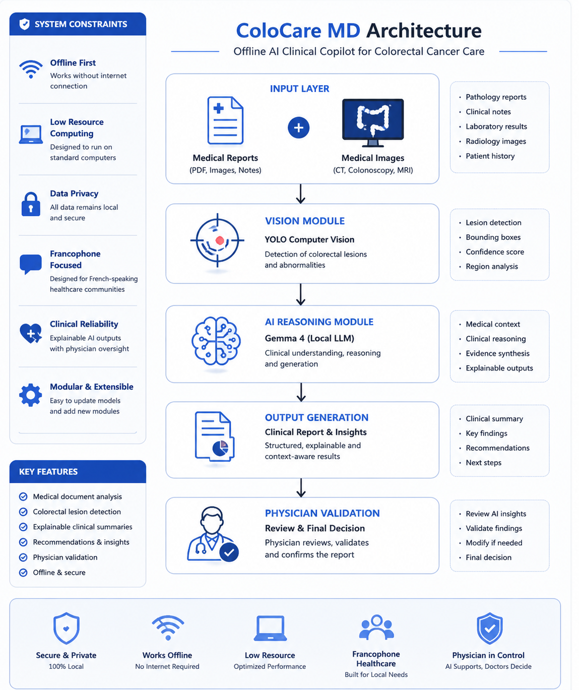
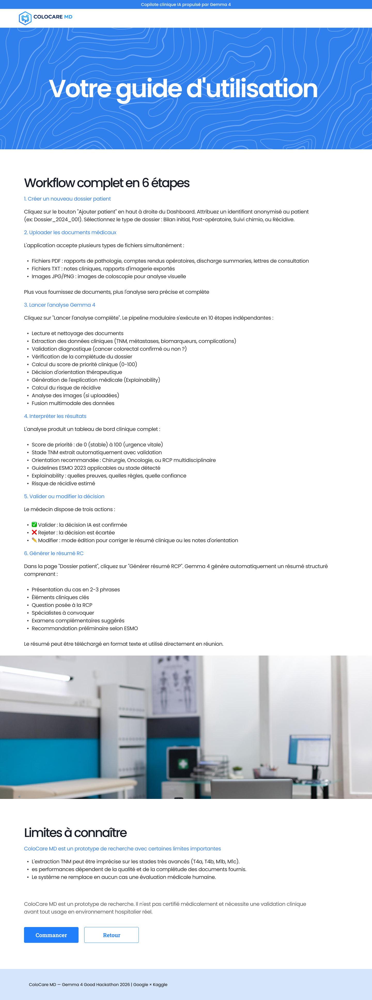

🏥 ColoCare MD
AI Clinical Copilot for Colorectal Cancer Care
Built for the Gemma 4 Good Hackathon — Google × Kaggle 2026 

🎯 Problem

Colorectal cancer is the 2nd most deadly cancer worldwide — 1.9 million new cases per year (WHO).
In Tunisia and francophone North Africa, incidence has doubled in a decade (4,000+ new cases/year in Tunisia alone). Oncologists receive 15–25 new patient files per day, each requiring 30–60 minutes of manual cross-analysis across pathology reports, imaging, lab results, and colonoscopy findings.
Critical constraint: Most public hospitals in the Maghreb have unstable internet, no cloud budget, and strict data privacy policies that prohibit sending medical data to external servers.
Existing AI solutions (GPT-4, Gemini API) are unusable in this context.

💡 Solution

ColoCare MD is a fully offline AI clinical copilot specialized in colorectal oncology.
Built on Gemma 4 via Ollama — runs entirely on standard hospital computers with no internet required.

Physician uploads documents/images
        ↓
Gemma 4 + YOLO analyze locally
        ↓
Structured clinical report generated
        ↓
Physician validates before any data is saved
        ↓
Patient record created in local database

🔬 YOLO Model — Validation Results
Custom YOLOv8 model trained on Kvasir-SEG (1,000 annotated colonoscopy images).
Metric Value Accuracy 95% |Sensitivity 98% |Specificity 85% | Images tested 80.
98% sensitivity means the system misses fewer than 2% of real lesions — critical in oncology.

🏗️ Architecture

                 INPUT LAYER                         
  Medical Reports (PDF/TXT)  +  Medical Images       

                     ↓
                PROCESSING LAYER                    
                                                     
  Gemma 4 (9.6GB, local)    YOLOv8 (custom trained)  
  ├── JSON medical extraction  ├── Polyp detection   
  ├── TNM classification       ├── Bounding boxes    
  ├── Clinical reasoning       └── Confidence score  
  └── RCP report generation                          

                     ↓

                  OUTPUT LAYER                       
  • Priority score (0–100)                           
  • TNM staging (T/N/M)                              
  • ESMO 2023 guidelines                             
  • Explainability (evidence + rules activated)      
  • Therapeutic orientation                          
  • RCP summary                                      
                     ↓

              PHYSICIAN VALIDATION                     
  ✅ No data saved without explicit doctor approval 
  ✅ Doctor modifies, validates, or rejects          
  ✅ Final decision always belongs to the physician  

📊 3 Clinical Scenarios

Scenario 1 — Text documents only
PDF/TXT → Gemma 4 extraction → TNM auto-staging
→ Priority score → ESMO orientation → Structured report → Physician validation

Scenario 2 — Medical image only
Colonoscopy image → YOLO detection → Bounding boxes + confidence
→ Gemma 4 image report → Specialist orientation → Physician validation

Scenario 3 — Documents + Images (multimodal fusion)
Documents + Images → Gemma 4 + YOLO in parallel
→ Fusion → Unified clinical report → Physician validation

🧪 Clinical Demo — Example Patient

Patient: A.62 years old
Documents: Pathology report + Operative note
TNM: T3N1aM0 | Stage :IIIA | Histology: MModerately differentiated adenocarcinoma |KRAS : status Wild-type | Priority Score :75/100 🔴 URGENT

Score factors:
T3 — beyond colonic wall (+22)
N1 — 1 positive lymph node (+12)
Medium clinical urgency (+7)

Recommendation: Visceral Surgeon + Medical Oncologist
Protocol: FOLFOX × 12 cycles (post-surgery, ESMO 2023)
Recurrence risk: Moderate — 45/100

🌍 Impact

- New colorectal cancer cases/year (Tunisia) : 4,000+
- Patient files per physician per day : 10-25
- Manual analysis time per file : 30 min/file 
- Estimated time saved with ColoCare MD : 10 min/file
- Target population : Maghreb + Francophone Africa
- Deployment cost : €0 (fully offline, open source)

⚙️ Tech Stack
- LLM : Gemma 4 (gemma4:latest) via Ollama
- Computer Vision : YOLOv8 custom trained
- Frontend : Streamlit
- Database : SQLite (local)
- PDF processing : PyMuPDF
- Visualizations :Plotly
- LanguagePython : 3.11
- Training : datasetKvasir-SEG (1,000 images)
- Clinical guide : linesESMO 2023
- UI/UX Design :  Figma (wireframes + design system)
 
🎨 UI/UX Design

Interface designed in **Figma** before implementation.

- Landing Page

- À propos

- Guide

🚀 Installation

1. Clone repository
bashgit clone https://github.com/yosrasallemi/colocare-md.git
cd colocare-md
2. Install Python dependencies
bashpip install -r requirements.txt
3. Install Ollama
Download from https://ollama.com
4. Download Gemma 4
bashollama pull gemma4:latest
5. Copy YOLO model
bash# Place your trained best.pt in:
mkdir models
cp path/to/best.pt models/best.pt
6. Run the application
bash# Terminal 1
ollama serve

# Terminal 2
streamlit run app.py
Requirements

Python 3.11+
Ollama
12GB+ RAM (for Gemma 4)
Streamlit, PyMuPDF, Plotly, Ultralytics

📁 Project Structure

colocare-md :

├── app.py                     # Main application
├── models/
│   └── best.pt                # YOLO trained model
├── modules/
│   ├── gemma_client.py        # Gemma 4 integration
│   ├── pipeline.py            # 3-scenario pipeline
│   ├── yolo_detector.py       # YOLO + Gemma vision
│   ├── pdf_reader.py          # PDF extraction
│   ├── json_extractor.py      # Structured extraction
│   ├── rules_engine.py        # ESMO clinical rules
│   ├── scoring.py             # Priority scoring
│   ├── explainability.py      # AI explainability
│   ├── diagnosis_validator.py # Diagnosis validation
│   ├── prognosis_engine.py    # Recurrence risk
│   ├── multimodal_fusion.py   # Text + image fusion
│   ├── database.py            # SQLite local DB
│   └── conversation_memory.py # Chat history

📚 Datasets

- Kvasir-SEG : YOLO training — 1,000 annotated colonoscopy images
- MIMIC-IV Note : Discharge summaries + radiology reports (testing)
- MTSamples : Clinical report templates 
- PubMed : 30 colorectal cancer case reports
- Synthetic :  patients 4 simulated patient records for demo

🔮 Future Work

- Gemma fine-tuning on colorectal oncology corpus
- Multilingual support ( French, English)
- DICOM imaging support (CT, MRI)
- Integration with hospital information systems
- Prospective clinical validation study
- Extended to other GI cancers

🏆 Hackathon

Competition: Gemma 4 Good Hackathon — Google/Kaggle 2026
Track: Health & Sciences
Core technology: Gemma 4 via Ollama (offline/edge)
Key differentiator: 100% local deployment for low-resource healthcare environments

⚠️ Medical Disclaimer
ColoCare MD is an AI-assisted clinical decision support tool.
It does not replace physician judgment. Every recommendation includes an explicit justification and requires mandatory human validation. 
Final medical decisions always belong to the physician.
Not certified for clinical use. Requires clinical validation before real-world hospital deployment.